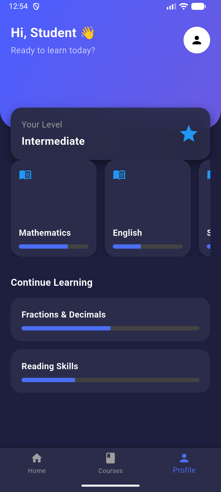

# AI-Powered Micro-Learning Platform 📱🤖

## 🚀 Overview
An AI powered mobile learning platform that delievers personalized eductaion using machine learning.

This project is an AI-powered mobile application built using Flutter, designed to deliver personalized micro-learning experiences.

The platform focuses on providing short-duration (5–10 minutes) learning modules and uses machine learning to recommend content based on user performance.

---

## 🎯 Key Features

### 📚 Micro-Learning Modules

* Short, focused lessons for quick learning
* Designed for time-constrained learners

### 🧠 AI-Based Recommendation System (In Progress)

* Suggests personalized lessons based on user performance
* Adapts learning path dynamically

### 📊 Aptitude Assessment

* Evaluates user’s current knowledge level
* Helps in personalized learning recommendations

### 📈 Progress Tracking & Analytics

* Tracks performance over time
* Provides insights into user improvement

### 📱 Mobile Application (Flutter)

* Clean and responsive UI
* Optimized for Android devices

### 🔄 Offline Support

* Access learning content without internet
* Sync data when connection is available

### 🛠 Admin Dashboard (Planned)

* Manage users, courses, and analytics

---

## 🛠 Tech Stack

* **Frontend:** Flutter (Dart)
* **Machine Learning:** Python (Planned)
* **Database:** (To be implemented)
* **Tools:** Git, GitHub

---

## 📱 Screenshots



*(More screenshots coming soon as development progresses)*

---

## 🧠 System Architecture

User → Flutter App → Backend (Planned) → ML Model → Personalized Recommendations

---

## 📂 Project Structure

```bash
lib/                # Flutter app source code
  ├── models/       # Data models
  ├── screens/      # UI screens
  ├── services/     # Business logic
  ├── theme/        # UI styling

android/            # Android build files
ios/                # iOS build files
web/                # Web support
windows/            # Windows support
linux/              # Linux support
```

---

## 🚧 Current Progress

* ✅ UI screens development completed
* ✅ Core app structure implemented
* 🚧 Machine Learning integration in progress
* ⏳ Backend development pending

---

## 💡 Future Enhancements

* Advanced recommendation system (ML-based)
* Gamification features
* Multi-language support
* Cloud backend integration
* Real-time analytics dashboard

---

## 🎯 Goal

To make learning accessible, personalized, and efficient using AI-driven technology.

---

## 🤝 Contributing

This is a personal project, but suggestions and feedback are always welcome!

---

## ⭐ If you like this project

Give it a star ⭐ on GitHub — it motivates me to build more!
